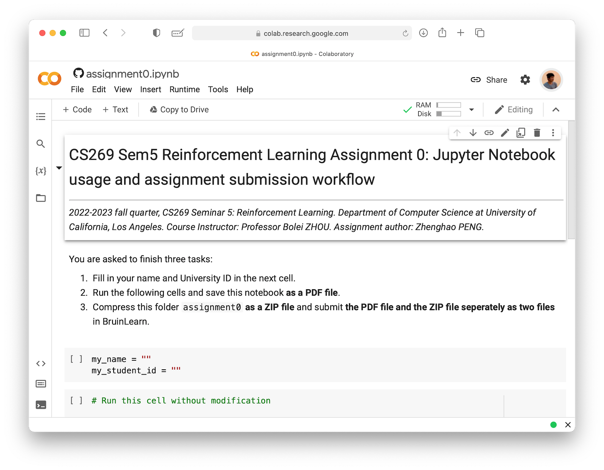
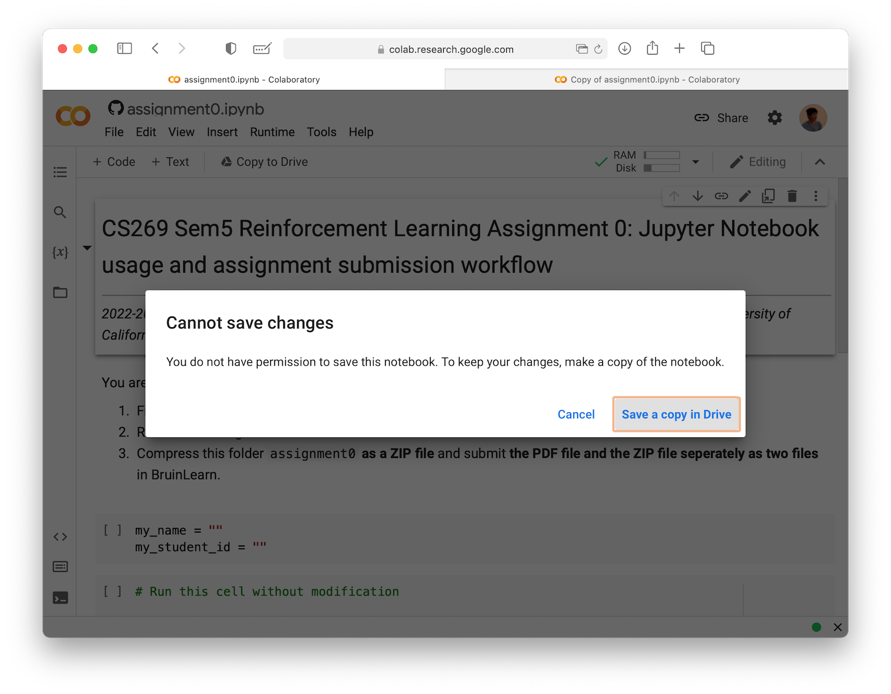
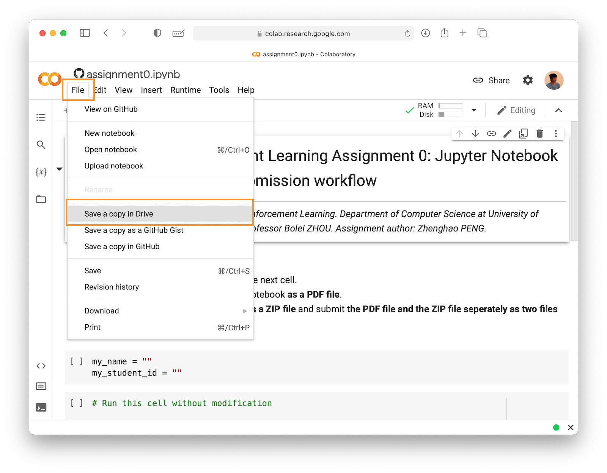
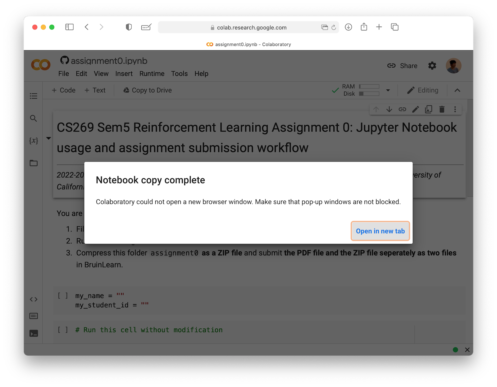
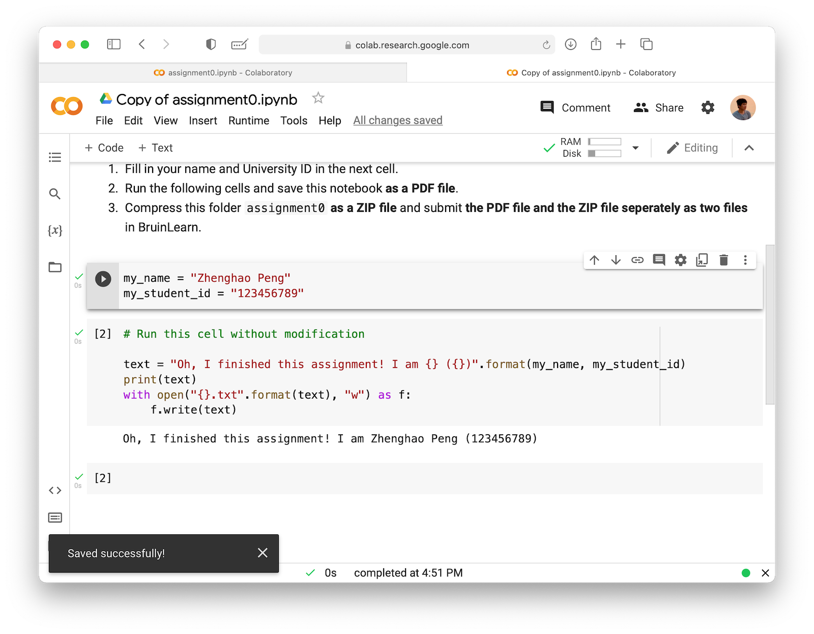

# Colab Instruction

In the assignments, you may find the badge as:

Click on the button and you will be redirected to the colab website and shown the assignment notebook. The pop up window looks like:

Please **do not start coding** since your edits will not be saved, as shown:

Before writing your code, please make sure you already click `File - Save a copy in ...` to transfer the ownership of the notebook to yourself:

After that, you will see a new popup window:

In the new popup window, you can save your edits as:

*Now start coding!*

---

### Some notes

You can use local machine and/or colab to edit and run your code. We don't require which platform you use.

You can download the assignment in local machine, edit it and make all tests passed, then upload the notebook to Google drive and open it in colab.
By doing so you can accelerate debugging while utilize free computing resource to run your code.

Colab has usage limit. Please check colab policy very carefully to avoid your training being unexpectedly stopped or unsaved.

------

*2022-2023 fall quarter, CS269 Seminar 5: Reinforcement Learning. Department of Computer Science at University of California, Los Angeles. Course Instructor: Professor Bolei ZHOU. Assignment author: Zhenghao PENG.*

